# Roleplay Studio - Lucidchart Architecture Diagram

## Quick Import: Mermaid (Lucidchart supports this)

In Lucidchart: **File → Import → Mermaid**

```mermaid
flowchart TB
    subgraph Users["👤 USERS"]
        Browser["Web Browser / Mobile"]
    end

    subgraph Domain["🌐 DOMAIN LAYER"]
        GoDaddy["GoDaddy\n(Domain Registrar)\nroleplaystudio.ai"]
        Vercel_DNS["Vercel\n(DNS + SSL)"]
        Zoho["Zoho Mail\n(Email Hosting)\nhello@roleplaystudio.ai"]
    end

    subgraph App["⚡ APPLICATION LAYER"]
        Vercel["Vercel Hosting"]
        subgraph NextJS["Next.js Application"]
            Pages["Pages & Components\n- Landing\n- Studio\n- Admin\n- Categories"]
            API["API Routes\n- /api/usage\n- /api/rating\n- /api/admin"]
            Static["Static Assets"]
        end
    end

    subgraph Auth["🔐 AUTHENTICATION"]
        Clerk["Clerk\n- Sign up/in\n- Sessions\n- Trial tracking"]
    end

    subgraph Voice["🎙️ VOICE AI"]
        ElevenLabs["ElevenLabs\n- 27 AI Agents\n- Voice Synthesis\n- WebSocket Streaming"]
    end

    subgraph Data["💾 DATA LAYER"]
        MongoDB["MongoDB Atlas\n- Ratings\n- Sessions\n- Usage logs"]
        LocalStorage["Browser Storage\n- Preferences\n- History"]
    end

    subgraph Payments["💳 PAYMENTS"]
        Stripe["Stripe\n- Subscriptions\n- Checkout\n- Webhooks\n(Planned)"]
    end

    subgraph Dev["🛠️ DEVELOPMENT"]
        GitHub["GitHub\nNeo-AI-Matrix/\nroleplay-studio"]
        OpenClaw["OpenClaw\nAI Development Agent"]
        subgraph LLMs["LLM Providers"]
            Claude["Anthropic\nClaude Opus 4"]
            OpenAI["OpenAI\nGPT-4 / Whisper"]
            Kimi["Moonshot\nKimi"]
        end
        Tailscale["Tailscale\nVPN Mesh"]
    end

    Browser --> Vercel_DNS
    GoDaddy --> Vercel_DNS
    GoDaddy -.-> Zoho
    Vercel_DNS --> Vercel
    Vercel --> NextJS
    NextJS --> Clerk
    NextJS --> ElevenLabs
    NextJS --> MongoDB
    NextJS -.-> Stripe
    Browser --> LocalStorage
    
    OpenClaw --> GitHub
    GitHub --> Vercel
    OpenClaw --> Claude
    OpenClaw --> OpenAI
    OpenClaw --> Kimi
    Tailscale --> OpenClaw
```



---

## Manual Build: Shape-by-Shape Guide

If Mermaid import doesn't work, use this to build manually:

### Layer 1: Users (Top)
| Shape | Label | Color |
|-------|-------|-------|
| Rectangle | 👤 USERS - Web Browser / Mobile | Light Gray |

### Layer 2: Domain Layer
| Shape | Label | Color | Notes |
|-------|-------|-------|-------|
| Container | 🌐 DOMAIN LAYER | Light Blue border | Groups the 3 below |
| Rectangle | **GoDaddy** | Orange | Domain Registrar, roleplaystudio.ai |
| Rectangle | **Vercel** | Black | DNS + SSL |
| Rectangle | **Zoho Mail** | Yellow | Email Hosting, hello@roleplaystudio.ai |

### Layer 3: Application Layer
| Shape | Label | Color | Notes |
|-------|-------|-------|-------|
| Container | ⚡ APPLICATION LAYER | Purple border | |
| Rectangle | **Vercel Hosting** | Black | Contains Next.js |
| Container | **Next.js Application** | White | Contains 3 boxes below |
| Rectangle | Pages & Components | Light Purple | Landing, Studio, Admin, Categories |
| Rectangle | API Routes | Light Purple | /api/usage, /api/rating, /api/admin |
| Rectangle | Static Assets | Light Purple | Images, Fonts, Icons |

### Layer 4: Services (Side by Side)

**Authentication:**
| Shape | Label | Color |
|-------|-------|-------|
| Rectangle | 🔐 **Clerk** | Purple |
| | Sign up/in, Sessions, Trial tracking | |

**Voice AI:**
| Shape | Label | Color |
|-------|-------|-------|
| Rectangle | 🎙️ **ElevenLabs** | Blue |
| | 27 AI Agents, Voice Synthesis, WebSocket | |

**Data Layer:**
| Shape | Label | Color |
|-------|-------|-------|
| Rectangle | 💾 **MongoDB Atlas** | Green |
| | Ratings, Sessions, Usage logs | |
| Rectangle | **Browser Storage** | Light Green |
| | Preferences, History | |

**Payments:**
| Shape | Label | Color |
|-------|-------|-------|
| Rectangle | 💳 **Stripe** | Blue |
| | Subscriptions, Checkout, Webhooks | |
| | (dashed border = planned) | |

### Layer 5: Development (Bottom)
| Shape | Label | Color | Notes |
|-------|-------|-------|-------|
| Container | 🛠️ DEVELOPMENT | Gray border | |
| Rectangle | **GitHub** | Black | Neo-AI-Matrix/roleplay-studio |
| Rectangle | **OpenClaw** | Orange | AI Development Agent |
| Container | LLM Providers | Light Gray | Contains 3 below |
| Rectangle | Anthropic Claude | Tan | Claude Opus 4 |
| Rectangle | OpenAI | Green | GPT-4, Whisper |
| Rectangle | Moonshot Kimi | Blue | Long-context |
| Rectangle | **Tailscale** | Blue | VPN Mesh |

---

## Connections (Arrows)

### Primary Flow (solid arrows)
```
Users → Vercel DNS → Vercel Hosting → Next.js
Next.js → Clerk (auth)
Next.js → ElevenLabs (voice)
Next.js → MongoDB (data)
```

### Deployment Flow (solid arrows)
```
OpenClaw → GitHub → Vercel (auto-deploy)
```

### Development Flow (solid arrows)
```
Tailscale → OpenClaw → LLMs (Claude, OpenAI, Kimi)
```

### DNS Flow (solid arrows)
```
GoDaddy → Vercel DNS
GoDaddy → Zoho (MX records)
```

### Planned (dashed arrows)
```
Next.js - - → Stripe
```

---

## Color Palette (Suggested)

| Category | Hex | Use |
|----------|-----|-----|
| Domain | `#E3F2FD` | Light blue |
| Application | `#F3E5F5` | Light purple |
| Auth | `#7C3AED` | Purple |
| Voice | `#3B82F6` | Blue |
| Data | `#10B981` | Green |
| Payments | `#6366F1` | Indigo |
| Development | `#F5F5F5` | Gray |
| Borders | `#E5E7EB` | Light gray |

---

## Lucidchart Tips

1. Use **Containers** for grouping layers
2. Enable **Auto-layout** after placing shapes
3. Use **Swimlanes** template for cleaner separation
4. Right-click → "Add to library" for reusable service icons
5. **File → Import → Mermaid** if you want to start from the code above
